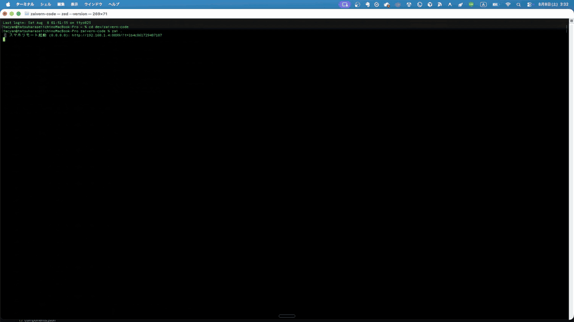

<div align="center">


# Zaivern Code

### Run Multiple Coding Agents Without Merge-Conflict Chaos.

**Start with 2 agents. Scale to 64.**
Zaivern Code stops overlapping edits before they land, so they never become
merge conflicts.

One window for Claude Code, Codex, Gemini CLI, and 30 other agent CLIs you have
already installed. Single native binary — macOS, Linux, Windows.

**English** | [日本語](README.ja.md) | [简体中文](README.zh-CN.md) | [한국어](README.ko.md) | [Português (Brasil)](README.pt-BR.md) | [Español](README.es.md)

[](https://github.com/tacyan/zaivern-code/releases/latest)
[](https://github.com/tacyan/zaivern-code/actions/workflows/test.yml)
[](LICENSE)


</div>

**Install and launch**

macOS / Linux:

```bash
curl -fsSL https://raw.githubusercontent.com/tacyan/zaivern-code/main/install.sh | sh
zai .
```

Windows PowerShell:

```powershell
irm https://raw.githubusercontent.com/tacyan/zaivern-code/main/install.ps1 | iex
zai .
```

Requires at least one supported coding CLI already installed and signed in.
Zaivern Code drives your existing CLIs and includes no AI model or subscription.

**Optional conflict coordination:**

```bash
zai czero init
```

This modifies the current Git repository.
[Preview and verify the changes →](#enable-conflict-coordination) ·
[Manual download and verification](SECURITY.md)

<div align="center">

<a href="https://zaivern.com/">
  
</a>

[**Quick Start**](#quick-start) ·
[**Benchmarks**](#benchmarks-and-limitations) ·
[**Docs**](#documentation) ·
[**Download**](https://github.com/tacyan/zaivern-code/releases/latest) ·
[**Website**](https://zaivern.com/)

</div>

*The clip above is the cockpit — several agent CLIs in one window. It does not show
the conflict coordination; that is measured separately, right below.*

## Proof

**64 agents, one repository, one workload.** Files = writers × 6, half of them
targeted by more than one agent. The same task list run twice: once through plain
git, once through Zaivern Code's line-range ledger.

| | Plain git | Zaivern Code |
|---|---:|---:|
| Merges that conflicted | 57 of 64 | **0 of 64** |
| Conflict hunks left for a human | 132 | **0** |
| Edits that landed | 384 of 384 | 202 of 384 |
| Writes stopped before landing | 0 | 182 |

**Zero is bought by refusing writes, not by merging both sides.** 182 of the 384
planned edits were stopped at the gate because another live agent already owned
those lines; 14 of the 182 were contention back-offs, which can succeed on retry.

**When the ranges really are disjoint, nothing is refused.** 64 agents editing 64
separate ranges of a *single* file land **64 of 64** edits with **0** refusals and
**0** conflict hunks — where a file-level lease lands 1 and refuses 63.

Semantic conflicts are **not** detected: one agent changing a signature while
another keeps calling the old one is allowed, and git merges it cleanly.

[Methodology, per-scale numbers, gate latency, and every open gap →](docs/conflict-zero.md)

## The problem

Running one coding agent is easy. Running four is not. **Two agents editing the
same file is already enough:**

- They edit the same lines, and you find out at merge time.
- You cannot see which agent is working, blocked, or quietly stuck.
- An approval prompt scrolls past in a tab you were not looking at.
- Integration becomes your job — every time.

The agents are not the bottleneck. The coordination between them is.

## The solution

Zaivern Code coordinates which parts of a repository each agent may safely edit.
Instead of discovering collisions at merge time, it catches overlapping work
**before the conflicting write lands** — and gives you one place to watch, steer,
and recover the agents you have running.

```text
Without Zaivern                          With Zaivern

Agent 1  ─┐                              Agent 1  ─┐
Agent 2  ─┤                              Agent 2  ─┤   ┌─────────────┐
Agent 3  ─┼─→ same files ─→ merge        Agent 3  ─┼─→ │ line-range  │ ─→ clean
   ...   ─┤                conflicts        ...   ─┤   │   ledger    │    integration
Agent 64 ─┘                              Agent 64 ─┘   └─────────────┘
```

## Quick Start

### Launch the multi-agent cockpit

Install with the one-liner at the top of this page, then run `zai .` in a project
folder. It opens the cockpit on that folder — agent tiles, editor, phone remote.
Click `+ Agent`, pick a CLI you have installed, and send it a task.
**This does not turn on conflict coordination**; that is the next step.

The installers check the downloaded archive against the release's `checksums.txt`
**before unpacking**, and abort if it does not match.
[Manual download, checksum verification, provenance, and SBOM →](SECURITY.md)

### Enable conflict coordination

```bash
zai czero init --dry-run  # preview the planned changes
zai czero init            # install the ledger and Git integration
zai czero verify          # verify it in throwaway repositories
zai .                     # launch the cockpit
```

- **`zai czero init --dry-run`** previews the planned changes without modifying
  the current repository.
- **`zai czero init` modifies the current Git repository.** It sets up the
  line-range ledger, adds the `pre-commit` / `pre-applypatch` / `pre-merge-commit`
  git hooks, registers the union merge driver, and writes a managed
  `.gitattributes` block — then self-diagnoses. It is idempotent.
- **`zai czero verify`** creates real overlapping writes and real merges in
  throwaway repositories and checks that each one is actually stopped. **It does
  not modify the current repository.** The verdict is `verified` / `partial` /
  `broken` — it will not report "verified" for a trial it could not run.
- **`zai czero doctor`** diagnoses which layers are still active, and
  **`zai czero uninstall`** removes exactly what `init` added.

### Updating

`zai update` shows the command it will run, then upgrades (`--check` only looks,
`--yes` skips the prompt). Works whether or not the editor is running.
`zai uninstall` removes it.

## Core features

Ordered by how much they set Zaivern Code apart. The first one is why it exists.

### 1. File and line-range ownership, enforced at write time

Agents claim files or line ranges before editing, anchored to the surrounding
content rather than to line numbers. If another live agent already owns an
overlapping region, a git hook refuses the write — at write time, not at merge
time. Same file, different lines is allowed, which is what keeps agents parallel
instead of serialising them behind a whole-file lock.
[How line-range coordination works →](docs/conflict-zero.md)

### 2. One screen, and you can see what each agent is doing

Tile several AI CLIs side by side and see at a glance which one is thinking,
editing, running, or waiting on you. Adding an agent is two clicks, not a
remembered command line.

### 3. Stall and exit detection

Zaivern Code watches semantic progress, not pixels: an agent that stops making
progress is reported as **stalled**, and unexpected exits surface as notifications.

### 4. Broadcast and targeted instructions

Send one instruction to every running agent from a single input box, or target one
agent when you want focused control.

### 5. Approvals

Approval-required mode is the default. Auto-YES is opt-in per session, privilege
escalation always needs a human, and MCP environment-variable values are never
displayed.

### 6. Phone remote

Check progress, send instructions, approve actions, and edit files from your phone.
Use the same Wi-Fi, [Tailscale](https://tailscale.com/), or an SSH tunnel.

### 7. Built-in editor

Review code and agent changes without leaving Zaivern Code, including Markdown,
images, PDFs, and CSVs. Unsaved buffers are recovered after a crash.

### 8. Context Engine — spend fewer tokens, whatever agent you run

Reading a 7,000-line file costs ~85k tokens. `zai context read` returns its
structure instead — the same file for ~3.4k tokens (-96%) — then you fetch just
the function you need with `--offset/--limit`. Search, symbol references,
directory maps, JSON and logs go through the same layer.

It is **provider-independent by construction**: nothing in the core branches on
which agent asked, so Claude Code, Codex, Gemini and the rest all get the same
behaviour. Nothing extra to install, and it never types into an agent or edits
your files — it runs only when you call it.

[Context Engine docs](docs/context-engine.md)

### 9. AI team runs — hand over a SPEC, get a managed development team

```sh
zai team run SPEC.md --agents 4
```

Zaivern reads the SPEC and — today, through a **deterministic `StaticPlanner`,
not an LLM** — derives a Goal and a Definition of Done, builds a task graph and
shows the plan, so the same SPEC always yields the same plan. Planning is a
swappable boundary (`TeamPlanner`), and an LLM planner drops in behind the same
validated `TeamPlan`:

```text
today:   SPEC → StaticPlanner (deterministic) → validated TeamPlan → task graph
planned: SPEC → LLM TeamPlanner               → the same TeamPlan  → task graph
```

Once you press **Start Team**, Zaivern launches only the agents the plan
actually needs, hands each one its task, and drives implement → validate →
review → revise → integrate to completion.

Nothing is marked complete because an agent said so. A task passes only through
`Running → Validating → Reviewing → Completed`, and a completion report is
rejected if the task id or agent id does not match, if it touched files outside
its scope, if the validation commands were not run or failed, or if a blocker is
still open. Reviews go to a **different session** than the one that wrote the
code. The `validation` block an agent reports is kept as **reference only**:
Zaivern runs the task's validation commands itself and advances to review only
on its own measured results.

Which commands run comes from the SPEC first. If its **Validation** section
lists commands, Zaivern uses exactly those and adds nothing. If it lists none,
Zaivern reads the repository — `Cargo.toml` → `cargo fmt --check` and
`cargo test`; `go.mod` → `go test ./...`; `package.json` → only the scripts
that actually exist (`test`, `lint`, `typecheck`, `check`), run through the
package manager the lockfile names; pytest only when the project clearly uses
it. If none of those markers is there, **Zaivern does not guess** — it asks you
to name the commands in the SPEC rather than running someone else's `cargo
test` against a Next.js repository. A validation command it cannot parse is
never silently dropped either: `npm test && npm run lint` comes back as a
shell-syntax error you can fix, kept distinct from `git push`, which is refused
on policy no matter how it is written.

Validation commands are **classified by risk**, not waved through by an
allowlist. A path-qualified executable (`/tmp/cargo test`, `./cargo test`,
`tools/python x.py`) is never run — matching on the basename alone would run
whatever `/tmp/cargo` happens to be. `push`, `merge`, `deploy`, `publish`,
privilege escalation and destructive commands are refused outright. And
anything that can execute code from the repository — `cargo test`, `npm test`,
`pytest`, `make`, `node`, `go test` — **waits for your approval before a single
line runs**, because a test body, a `build.rs` or a `Makefile` can do anything
a shell can. So does anything that would **write to your files**: `black .`
and `rustfmt src/lib.rs` need approval, while `black --check .` and
`rustfmt --check src/lib.rs` do not — the flag, not the tool's name, decides.
Zaivern also resolves the executable itself instead of letting the OS search
`PATH`, so a `rustfmt` planted inside the workspace can never stand in for the
real one. Being outside the workspace is not enough either: an agent runs with
your own privileges, so it can write to `~/.local/bin`, `~/bin` or
`%LOCALAPPDATA%`. Only an executable in a place that takes elevation to write
(`/usr/bin`, `/bin`, `/sbin`, `C:\Windows`, `C:\Program Files`) runs without an
approval on file — anywhere else, even a read-only check waits for you. That
excludes Homebrew: it makes `/opt/homebrew` (Apple Silicon) and `/usr/local`
(Intel) yours to write, so an agent can rewrite `/opt/homebrew/bin/rustfmt`
just as easily as `~/.local/bin/rustfmt`. And spelling alone never decides —
if the file or its directory turns out to be writable by you, its trust is
downgraded, never raised. Zaivern never falls back from an untrusted executable early in `PATH` to a
trusted one later, and no shell (`sh -c`, `cmd /C`) is ever placed between what
was checked and what runs. Every run has a timeout, is killed as a whole process tree when
you stop the team, and always settles: passed, failed, timed out, cancelled,
could not start, or runner disconnected. **An approval covers one validation
run, not a command name**: a different task, a re-run after a rejected review,
or a retry all ask again, because the code being tested is no longer the code
you approved. Zaivern does not sandbox what you approve — it guarantees what
gets started, not what that process then does.

The Organization Board shows the team lead, the specialist lanes, every parent
and child agent, what each is doing right now, the task graph's progress, test
and review results, and the one thing that most needs your attention.

[AI team docs](docs/team.md)

Also included: plugins, and a UI available in six languages.
[Plugin docs](docs/plugins.md) · [Translation docs](docs/translating.md)

## How it works

1. **Launch** coding agents from one window, or attach ones you already run.
2. **Claim** files or line ranges before editing, anchored to the content around them.
3. **Guard** — a git hook refuses an overlapping write before it reaches merge time.
4. **Integrate** — non-overlapping changes merge through git as usual.

## Supported agents

Claude Code · Codex · Gemini CLI · Cursor Agent · GitHub Copilot CLI ·
**28 more** — 33 launch presets in total, plus 6 agents drivable over ACP.

Any combination works, including a single agent.
Missing yours? [Request an integration](https://github.com/tacyan/zaivern-code/issues).

## Why Zaivern

|  | Terminal multiplexer | Generic agent dashboard | Zaivern Code |
|---|:---:|:---:|:---:|
| Line-range ownership + write-time refusal | ❌ | ❌ | ✅ |
| Knows agent state (thinking / blocked / stalled) | ❌ | varies | ✅ |
| One screen for every agent at once | ❌ | ✅ | ✅ |
| Approvals as notifications | ❌ | varies | ✅ |
| Phone / remote control | ❌ | varies | ✅ |
| Single native binary, no runtime | varies | varies | ✅ |

## Benchmarks and limitations

The 64-agent table at the top is synthetic. On **real repositories**, cloned and
replayed by `tools/anyrepo-prove.sh` with 16 writers (zai 0.14.0):

| Repository | Plain git | Zaivern Code |
|---|---|---|
| zaivern-code (Rust, 259 tracked files) | 26 conflicted files / 28 hunks | **0 / 0** — 96 of 96 edits landed, 0 refused, 30 shifted |
| hyperframes (TS/HTML, 1,194 tracked files) | 26 / 28 | **0 / 0** — 96 of 96 landed, 0 refused, 32 shifted |

Refusal is not the only outcome. When a claim collides, `--shift` moves it to the
nearest free range of the same width — which is why both rows above land every
edit and refuse none.

### What "zero conflicts" means

- **Ownership always holds.** "No two agents are handed the same lines" depends
  only on the ledger, not on file contents: `dup_lines = 0` in 126 of 126
  independently re-run proofs.
- **A clean merge is conditional.** In repetitive content — repeated code fences,
  generated code, the same line over and over — git can still conflict even when
  the claimed ranges are far enough apart. The gate refuses those claims instead
  of promising a merge it cannot guarantee.
- **Semantic conflicts are out of scope.** Overlapping line ownership is
  prevented; a changed signature and a stale caller in another file are not.
- **Disjoint work never needed help.** Ranges far enough apart already merge at
  zero conflicts under plain git. Line-range ownership gives back the parallelism
  that a file-level lease destroys — that is the comparison that matters.
- **It only enforces where git can enforce.** `zai lease claim` also succeeds in a
  non-git folder, but nothing is stopped there. `zai czero doctor` reports which
  repository shapes (worktrees, submodules, sparse-checkout, LFS, bare) are
  actually covered.

Reproduce any of it: `tools/conflict-bench.sh`, `tools/coedit-bench.sh`,
`tools/anyrepo-prove.sh --repo .`
[Full methodology and remaining gaps →](docs/conflict-zero.md) ·
[which guarantees hold for which repository shape →](docs/czero-repo-shapes.md)

## Supported platforms

| Item | Support |
|---|---|
| OS | macOS arm64/x86_64, Linux x86_64/arm64, Windows x86_64 |
| Distribution | Single native binary, no runtime; checksums, SBOM, and build provenance per release |
| AI CLIs | 33 launch presets, plus 6 over ACP |
| Tests | 5,005 in v0.23.0, run on macOS, Linux, and Windows in CI |
| License | Apache-2.0 |

## Documentation

| Document | What it covers |
|---|---|
| [docs/conflict-zero.md](docs/conflict-zero.md) | What "conflict-free" claims, what it does not, and every measurement behind it |
| [docs/context-engine.md](docs/context-engine.md) | The Context Engine: strategies, the workspace boundary, metrics, and the reduction benchmark |
| [docs/czero-repo-shapes.md](docs/czero-repo-shapes.md) | Which guarantees hold for which repository shape |
| [docs/idle-cost.md](docs/idle-cost.md) | How idle CPU and binary size are measured |
| [docs/plugins.md](docs/plugins.md) | Writing plugins, with the [format specification](docs/PLUGIN_SPEC.md) |
| [docs/team.md](docs/team.md) | `zai team`: how a SPEC becomes a task graph, what gates "complete", and what is never run automatically |
| [docs/README.md](docs/README.md) | Index of every other document, grouped by the claim it backs |

[Release notes](https://github.com/tacyan/zaivern-code/releases) ·
[Security policy](SECURITY.md) · [Contributing](CONTRIBUTING.md)

## Try it

Try Zaivern Code with two agents on the same repository:

```bash
zai czero init
zai .
```

Start two agents, point both at the same file, and watch the second overlapping
write get refused *before* it becomes a merge conflict. That is the whole idea, in
about a minute.

If it holds up for you, a ⭐ **Star** helps other people find it.

## Community

- Found a coordination edge case? [Open an issue](https://github.com/tacyan/zaivern-code/issues).
- Using a coding agent that is not supported yet? [Request an integration](https://github.com/tacyan/zaivern-code/issues).
- Running 8, 16, 32, or 64 agents? Share your numbers — `tools/conflict-bench.sh`
  and `tools/anyrepo-prove.sh` produce results comparable to the tables above.

Pull requests are welcome against `main` — [CONTRIBUTING.md](CONTRIBUTING.md) covers
building from source (Rust 1.88+), verifying a change, and running the Linux and
Windows checks locally.

## License

[Apache License 2.0](LICENSE)
