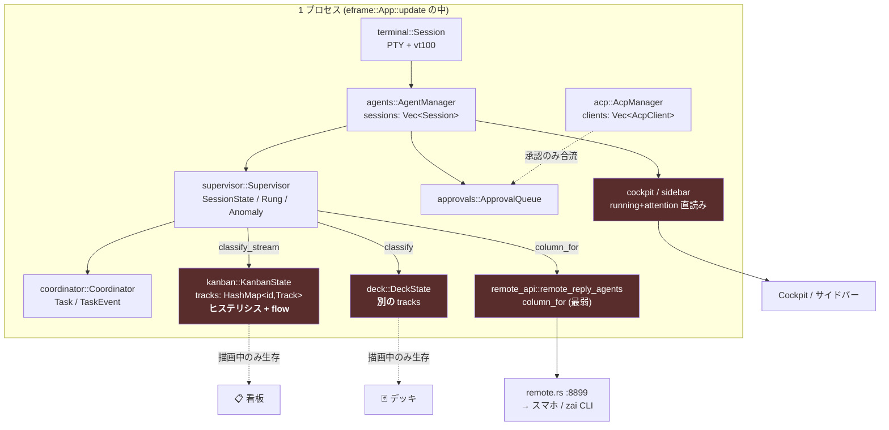
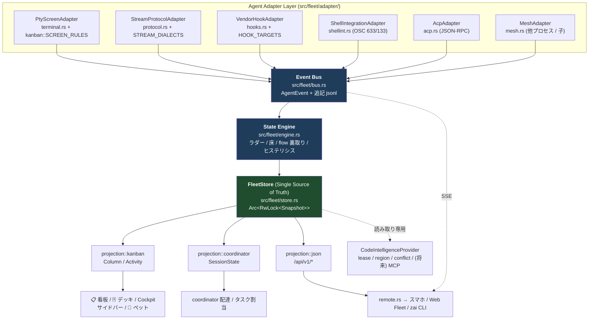
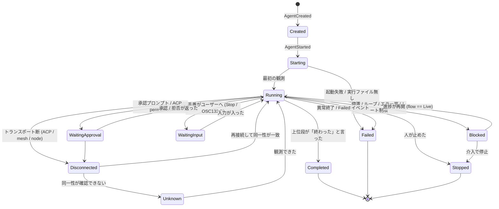
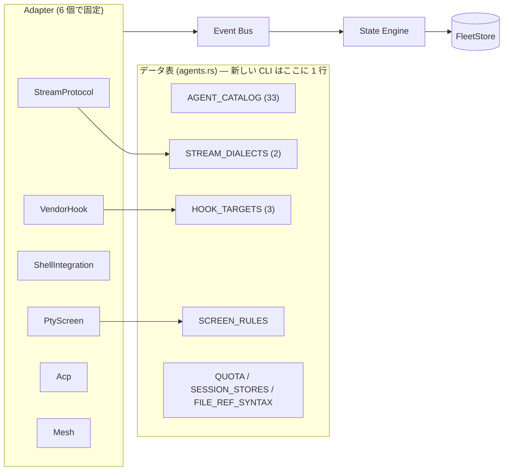
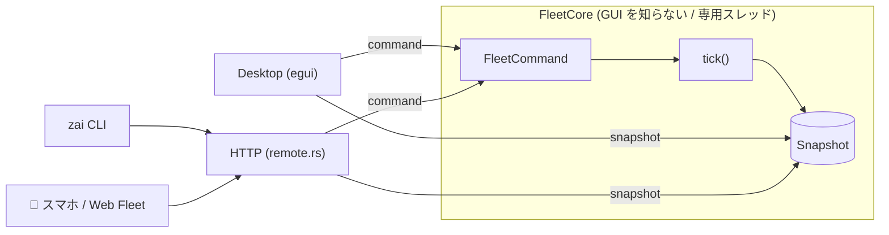
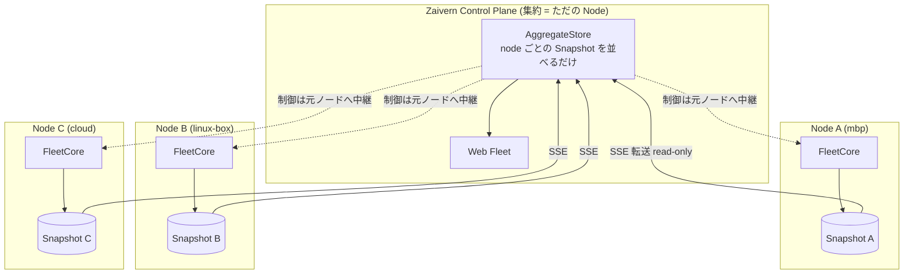

# Zaivern Control Plane 化 — アーキテクチャ設計書

> **状態: 設計のみ。実装は 1 行も入っていない。**
> Phase 1 の実装はオーナーの承認を待つ (依頼の最重要制約)。
>
> 調査対象: `main` = c5fa750 (0.22.3)。src 117 モジュール / 299,687 行。
> 数字はすべて実コードを読んで数えたもので、推測は「未確認」と明記する。

---

## 1. 現在の Zaivern アーキテクチャ概要

### 1-1. 一枚岩の実体

Zaivern は **1 プロセスの egui アプリ**で、`ZaivernApp` (`src/app/`, 54 ファイル /
48,339 行、うち `mod.rs` だけで 5,084 行) が
セッション・見張り・調停・承認・リモート・エディタ・git を**全部フィールドとして持つ**。

**エージェントに関する状態遷移は、例外なく `eframe::App::update` の中でだけ進む。**

| 段 | 呼び出し位置 | 何をするか |
|---|---|---|
| 入力 | `frame_update.rs:320` `agents.poll_events()` | PTY 画面を読み、承認プロンプト/レート制限/終了を検知 |
| 通信 | `frame_update.rs:225` `poll_remote(ctx)` | スマホ/CLI からの HTTP 要求に **UI スレッドで**応答 |
| 見張り | `frame_update.rs:482` `supervise(ctx, …)` | `Supervisor::tick` → 状態機械 + 異常検出 + ラダー汲み上げ |
| 描画 | `frame_update.rs:505-530` `CenterView` 分岐 | 看板 / デッキ / Cockpit のうち **1 つだけ**を描く |

`idle_repaint_ms` (`app/mod.rs:4889`) は「エージェントが走っていれば 250ms
(背面 1500ms)、そうでなければ寝る」。つまり**状態機械の刻みは再描画の刻みそのもの**である。

### 1-2. 既にある強い資産

再設計で**捨ててはいけない**ものが、想像よりずっと多く既にある。

| 層 | 実体 | 位置づけ |
|---|---|---|
| 状態ラダー | `supervisor::Rung` / `kanban::Source::rung()` | 設計原則 4 の実装。**Control Plane の心臓はもう書けている** |
| 構造化プロトコル | `protocol.rs` + `agents::STREAM_DIALECTS` | JSONL 方言をデータ表で持つ。**Adapter 層の原型** |
| ベンダーフック | `hooks.rs` + `agents::HOOK_TARGETS` | `zai hook` が投函箱 (`~/.zaivern/hooks/`) へ置く |
| シェル統合 | `shellint.rs` (OSC 633/133) | ベンダー非依存の終了コード = 事実 |
| ACP | `acp.rs` (5,107 行) | JSON-RPC 2.0 の**双方向**エージェント駆動。既に動く |
| 承認 | `approvals.rs` | **全エージェント横断の 1 本のキュー + ポリシー + 追記監査ログ** |
| 調停 | `coordinator.rs` | Task / TaskState / TaskEvent / 配達可否 (`deliverable`) |
| プロセス間通信 | `mesh.rs` (4,424 行) | Erlang 風 Pid/mailbox/link/monitor を**ファイルシステム上に**実装 |
| 行域の所有 | `lease.rs` / `region.rs` / `negotiate.rs` | 「同じ行を 2 人に配らない」台帳 |
| 多重起動 | `instances.rs` | `~/.zaivern/instances/<pid>.json` + OS 別の生存確認 |
| リモート | `remote.rs` + `assets/remote/` | LAN / SSH / Tailscale / Tailscale-HTTPS の 4 トランスポート |
| 拡張面 | `feature.rs` + `build.rs` の `src/features/*.rs` 走査 | 共有ファイルを 1 バイトも触らずに機能を足せる |

**特に `mesh.rs` の冒頭の一文が、この設計書の結論を先に書いている:**

> 「GUI が持っているメモリ上の状態は共有の事実になり得ない」

`lease` / `czero` はその結論に従って**もう GUI の外に出ている**。
Fleet だけがまだ出ていない。

### 1-3. 現状のデータフロー



赤い 4 つが「同じ質問に別々に答える 4 つの口」である。

---

## 2. Fleet 状態管理の現状

### 2-1. 状態を名乗る型が 7 つある

| # | 型 | 位置 | 値の数 | 誰が読むか |
|---|---|---|---|---|
| 1 | `supervisor::SessionState` | `supervisor.rs:394` | 8 | 看板・デッキ・調停・通知 |
| 2 | `protocol::ProtoState` | `protocol.rs:42` | 8 | ラダー上位 3 段の共通語彙 |
| 3 | `kanban::Activity` | `kanban.rs:293` | 10 | 看板カード・デッキ行 |
| 4 | `kanban::Column` | `kanban.rs:100` | 8 | レーン・KPI タイル・スマホ一覧 |
| 5 | `coordinator::SessionState` | `coordinator.rs:165` | 7 | 配達可否・タスク割当 |
| 6 | `acp::Phase` | `acp.rs:1859` | 6 | ACP パネル**のみ** |
| 7 | `notify::WorkPhase` | `notify.rs:374` | 3 | 完了通知の門番 |

さらに UI が直接読む生フラグとして
`Session::running()` / `attention` / `rate_limited` / `has_unread()` がある。

### 2-2. 状態を**判定する**入口が 6 つある

これが本題。同じ 1 体のエージェントについて、**同じ瞬間に 6 通りの答が出る**。

| 入口 | ラダー上位段 | 画面末尾 | flow 裏取り | ヒステリシス | 読み手 |
|---|---|---|---|---|---|
| `kanban::classify_stream` (`kanban.rs:910`) | ✅ | ✅ | ✅ | ✅ (`LaneTracker`) | 📋 看板 **描画中のみ** |
| `deck::update_tracks` (`deck.rs:740`) → `kanban::classify` | ❌ | ✅ | ❌ | 一部 | 🃏 デッキ **描画中のみ** |
| `kanban::column_for` (`kanban.rs:982`) | ❌ | ❌ (`&[]`) | ❌ | ❌ | **スマホ / `Card.column` / アクティビティフィード** |
| `app::coordinator_state` (`app/mod.rs:4107`) | ❌ | ❌ | ❌ | ❌ | 調停 (配達 / タスク割当) |
| `cockpit.rs:1013,1321` / `sidebar_ui.rs:508` | ❌ | ❌ | ❌ | ❌ | Cockpit / サイドバーの ●○ |
| `acp::Phase` | (ACP 自身) | ❌ | ❌ | ❌ | ACP パネル |

`kanban.rs:978` のコメントは
「優先順位は app.rs `coordinator_state` と同じ」と書いてあるが、
**同じなのは優先順位だけで、入力も出力も違う**。片方を直しても片方は直らない。

### 2-3. カタログの被覆率

| カタログ | 件数 | 対象 |
|---|---|---|
| `AGENT_CATALOG` (`agents.rs:425`) | **33** | 起動・承認モード・再開・切替キー |
| `STREAM_DIALECTS` (`agents.rs:2295`) | **2** (claude, codex) | ラダー 1 段目 |
| `HOOK_TARGETS` | **3** (claude, codex, gemini) | ラダー 2 段目 |

→ **33 体中 30 体は上位 2 段が構造的に沈黙している。**
その 30 体の状態は「見張り (画面ハッシュ)」か「画面末尾の表引き」でしか決まらない。
`Source::mark()` が `≈` を出すのはそこである。

---

## 3. Fleet 状態管理の問題点

依頼の書式 (`file` / `function・struct` / `current responsibility` / `problem` /
`recommended responsibility`) で並べる。**重い順**。

### P-1 【最重要】正準状態を「値」ではなく「関数」で持っている

- **file**: `src/kanban.rs`
- **function**: `classify_stream` / `classify_flow` / `classify` / `column_for` / `state_label`
- **current**: 引数から状態を導出する純関数。5 つの入口があり、渡せる引数がそれぞれ違う。
- **problem**: 純関数なので**呼ぶ側が入力を選べる**。`column_for` は
  `ladder=None, tail=&[], flow=Unknown` を渡すので、
  **構造化プロトコルが「編集中 ◆」と言っていても「思考中 ≈」を返す**。
  スマホ (`remote_api.rs:437`) と看板カードの初期値 (`kanban_deck_git.rs:46`)
  がこの弱い入口を使っている。番人テスト
  `一覧の状態は看板の判定をそのまま出す` (`remote_api.rs:2818`) は
  「`column_for` を呼んでいること」しか見ていないので、**この食い違いを検出できない**。
- **recommended**: `classify_*` は **Store の内部実装**に降格し、
  外へ公開するのは「読むだけの 1 つの値」にする。入力の選択権を呼び出し側から取り上げる。

### P-2 【最重要】時間依存の状態がビューのメモリにある

- **file**: `src/kanban.rs` / `src/deck.rs`
- **struct**: `KanbanState.tracks: HashMap<u64, Track>` / `DeckState.tracks`
- **current**: ヒステリシス (`LaneTracker`, `Column::hold_ms`)、
  `Flow` の裏取り (`progress_ms` / `norm`)、`TROUBLE_HOLD_MS` の継続確認を持つ。
  **看板の真実は事実上ここにある。**
- **problem**: `update_tracks` は `kanban::draw` (`kanban.rs:2309`) からしか呼ばれず、
  `kanban_ui` は `self.center == CenterView::Kanban` のフレームでしか走らない
  (`frame_update.rs:519`)。つまり:
  - **看板を閉じている間、ヒステリシスも flow の裏取りも 1 ミリ秒も進まない。**
  - 看板 → デッキ → 看板 と切り替えると `Track::new` からやり直し
    (= 「停滞・異常」の `TROUBLE_HOLD_MS` の計時が**リセットされる**)。
  - デッキは**別の** `tracks` を持ち、しかも `kanban::classify` (ラダー無し) で回す。
    同じ 1 体が看板とデッキで違うレーンに居ることが構造的に起こる。
- **recommended**: `Track` を `FleetStore` へ移し、**ビューは読むだけ**にする。
  ビューの生き死にと状態の前進を切り離す。

### P-3 状態の前進が再描画ループに従属している

- **file**: `src/app/frame_update.rs`
- **function**: `update_impl` (`:107`) → `supervise` (`:482`) / `poll_remote` (`:225`)
- **current**: 全部フレームの中。`idle_repaint_ms` が刻みを決める。
- **problem**:
  1. **GUI が無いと状態が存在しない。** Headless (`zaivern server`) が原理的に作れない。
  2. スマホからの `/api/agents` は `remote.rs` が `request_repaint()` で
     UI を叩き起こして初めて答が作られる。**複数クライアントが同時に見ると
     UI スレッドが順番待ちの列になる** (`Request::respond` は最大 3 秒待ち)。
  3. `zai session list` (`cli.rs:2262`) は `GET /api/state` を叩くので、
     **CLI も GUI の再描画に依存している**。
- **recommended**: `FleetCore` を独自スレッドの tick で回し、
  UI と HTTP はその**スナップショットの読者**にする。

### P-4 セッション同一性がプロセス内 `u64` しかない

- **file**: `src/terminal.rs` / `src/session.rs`
- **struct**: `Session.id: u64` (`AgentManager::next_id` の連番) / `AgentSessionRec`
- **current**: `id` はプロセス内の採番。永続化 (`AgentSessionRec`) には
  `preset_name` / `title` / `command` / `cwd` / `log_file` しか無く、**状態も系譜も残らない**。
- **problem**:
  - 再起動で ID が変わる → 「Zaivern 再起動時」の状態は**必ず UNKNOWN から**。
  - `SuperAgentConfig.session_title` が**タイトル文字列で指揮官を指す**のはこの回避策
    (`config.rs:637`)。タイトルは利用者が変えられるので壊れる。
  - `parent_agent_id` / `root_agent_id` / `task_id` / `provider` を置く場所が無い。
    リポジトリ全体で `parent_agent` の grep 結果は **0 件**。
  - ACP は `ACP_SESSION_ID_BASE = 1<<48` (`acp.rs`) で ID 空間を分けているだけで、
    同じ「エージェント」という概念に乗っていない。
- **recommended**: `AgentId` を**安定 ID** (ワークスペースキー + 起動時刻 + 連番、
  `history::fnv1a64` 系) にし、系譜フィールドを持つ Canonical Agent へ。

### P-5 ACP セッションが Fleet に 1 体も現れない

- **file**: `src/acp.rs` / `src/app/kanban_deck_git.rs`
- **struct**: `AcpManager.clients: Vec<AcpClient>` (`acp.rs:2818`)
- **current**: ACP は独立したパネル。承認だけ `ApprovalQueue` へ合流する。
- **problem**: `kanban.rs` / `deck.rs` / `app/kanban_deck_git.rs` に
  **`acp` の文字列は 1 件も出てこない**。
  ラダーの**最上段で駆動しているエージェントが、Fleet の集計に入っていない**。
  「Total Agents」が嘘になる、いちばん分かりやすい形の破れ。
- **recommended**: `AgentAdapter` の 1 実装として Fleet へ載せる。
  ACP パネルはそのまま残す (詳細ビュー)。

### P-6 指揮官 (Super Agent) が最下段の画面スクレイプで動いている

- **file**: `src/app/orchestrate.rs` / `src/commander.rs`
- **function**: `drive_commander` (`orchestrate.rs`) / `commander::parse_directives`
- **current**: 指揮官セッションの**vt100 画面テキスト**を毎フレーム読み、
  `@対象: 指示` の行を正規表現で拾う。既読は `commander_seen` (512 件の LRU)。
- **problem**: 設計原則 4 が禁じている画面スクレイプを、
  **いちばん権限の高い経路**に使っている。行が折り返せば拾えない。
  端末幅を変えると挙動が変わる。`INJECT_PREFIX` のこだま除け
  (`coordinator.rs:508`) が唯一の無限ループ止めになっている。
- **recommended**: 指示は**イベント**として運ぶ (`mesh::Msg::Custom` か
  ACP の `session/update`)。画面スクレイプは互換のため残すが、
  ラダーの最下段として明示し、上段が使えるときは使わない。

### P-7 調停が第 2 のラダーを持っている

- **file**: `src/app/mod.rs:4107`
- **function**: `coordinator_state`
- **current**: `running / attention / rate_limited / sup` → `coordinator::SessionState`。
  「曖昧なら `Unknown`」という**正しい**方針で書かれている。
- **problem**: この方針そのものは正しいのに、**看板と入力が違う**ので
  「看板は編集中 ◆ (構造化) と言っているのに、調停は Unknown なので何も配達しない」
  が起こる。ラダー上位段の情報が**配達判断に届いていない**。
- **recommended**: `Canonical → coordinator::SessionState` の**射影 1 本**にする。
  fail-closed の方針 (`deliverable` が `Idle`/`AwaitingInput` だけ真) はそのまま維持。

### P-8 Cockpit / サイドバーが 3 値へ独自に潰している

- **file**: `src/app/cockpit.rs:1013,1321` / `src/app/sidebar_ui.rs:508`
- **current**: `if running { if attention { warn } else { ok } } else { err }`。
- **problem**: 見張りを 1 バイトも見ていない。**停滞中のエージェントが緑の ● で表示される。**
  Cockpit は「全エージェントを一望する」ための画面なのに、看板といちばん食い違う。
- **recommended**: Store の `AgentView` を読み、`Source::mark()` も一緒に出す。

### P-9 スマホがヒステリシスも裏取りも持たない

- **file**: `src/app/remote_api.rs:437`
- **function**: `remote_reply_agents`
- **current**: `kanban::column_for` + `kanban::state_label` を呼び、
  `screen_tail_lines(2,120)` を preview として返す。
- **problem**: レーンがヒステリシス無しなので、**スマホでだけカードが激しく往復する**。
  さらに `trouble_confirmed` を通らないので、
  `Read(src/error_handling.rs)` を出しているだけの健全なエージェントが
  **スマホでだけ「停滞・異常」に落ちる** (CLAUDE.md が根治したと書いた不具合が、
  この経路にだけ残っている)。
- **recommended**: Store のスナップショットをそのまま JSON 化する。

### P-10 複数クライアント間で状態が同期しない

- **file**: `src/remote.rs` / `src/app/remote_api.rs`
- **current**: 全部ポーリング (`45-term.js` の `setTimeout(pollTerm, LIST_POLL_MS)`)。
- **problem**: プッシュが無い。2 台のスマホが同時に見ていると、
  片方が承認した結果がもう片方に**次のポーリングまで**反映されない。
  承認は競合しうる操作なので、これは実害になる。
- **recommended**: `GET /api/v1/events` (SSE) を足す。**ポーリングは残す**
  (Tailscale 経由や不安定な回線でのフォールバック)。

### P-11 発見が単一インスタンス前提

- **file**: `src/cli.rs:44` `instance_path()` = `~/.zaivern/instance.json`
- **problem**: `instances.rs` は**複数インスタンスのレジストリを持っている**のに、
  `zai` の接続先は 1 ファイル 1 件。後から起動した Zaivern が上書きする。
  CLAUDE.md が「複数の AI エージェントが同時編集する前提」と書いている
  リポジトリで、**CLI からは常に最後の 1 つしか見えない**。
- **recommended**: `instances/<pid>.json` に port/token を持たせ、
  `instance.json` は互換のための「既定の 1 つ」に降格。Multi-Node の最初の 1 歩。

### P-12 再接続 / 切断が状態として存在しない

- **file**: `src/remote.rs` / `src/acp.rs`
- **problem**: `Bind` が 4 つあり Tailscale も通るのに、
  **`DISCONNECTED` に相当する状態が無い**。
  ACP は `Phase::Failed(String)` を持つが Fleet に出ない。
  「見えないから居ない」と「居るが見えない」を区別できない。
- **recommended**: Canonical に `Disconnected` を持ち、**最後に見た状態と時刻を添える**。

### P-13 状態遷移の履歴が上限付きのメモリだけ

- **file**: `src/supervisor.rs` `StateTransition` / `history_capacity`
- **problem**: 追記ログが無い。`approvals.jsonl` は**あるのに**、
  状態遷移には無い。再起動で全部消える。Fleet History (Enterprise 候補) の
  土台がゼロから要る。
- **recommended**: `approvals.rs` と同じ流儀で `~/.zaivern/fleet/events.jsonl`
  (ローテート付き、`AUDIT_MAX_BYTES` と同じ作法)。

---

## 4. 根本原因

上の 13 個は、**5 つの原因**に畳める。

### R1. 真実が「値」ではなく「導出関数」である

`classify_*` は純関数で、**引数を呼び出し側が選べる**。
純関数化そのものは正しい (テストできる) が、**公開範囲を間違えた**。
純関数は Store の内部にあるべきで、外に出すと入力の選択権が漏れる。

> CLAUDE.md 自身がこの型の失敗を 2 回記録している —
> 「同じ事実を 2 箇所に持つと片方だけ更新される経路が必ずできる」
> (`StateVerdict` の doc)、「真実の在り処を 1 つに保つ」(言語パック)。
> **Fleet だけがこの規律から漏れている。**

### R2. 時間を持つ状態が、寿命の短い所有者の中にある

ヒステリシス・`Flow`・`TROUBLE_HOLD_MS` は**時間の関数**なので、
連続して観測しないと意味を持たない。それを `KanbanState` (ビューのメモリ) に
置いた瞬間、**ビューが閉じている時間の情報が消える**。
設計原則 1 (「ターミナルのモデルはウィンドウより長生きさせる」) が
端末には適用されているのに、Fleet 状態には適用されていない。

### R3. 状態の前進が「描画」に従属している

設計原則 3 (アイドル時のコストはゼロ) を守るために再描画を止める。
ところが状態機械が再描画に乗っているので、**節約すると同時に見えなくなる**。
この 2 つは本来トレードオフではない — 分ければ両立する。

### R4. 同一性がプロセスの寿命しか持たない

`u64` の連番。再起動・多ノード・親子関係のどれにも耐えない。
`SuperAgentConfig.session_title` (タイトル文字列で指す) が、その不在の回避策として
既に config に露出している。

### R5. 「状態」という 1 語に 3 つの異なる問いが混ざっている

- **生死・段階** (プロセスは生きているか / 終わったか) — Lifecycle
- **いま何をしているか** (思考 / 編集 / 実行 / 検証) — Activity
- **どれだけ信じてよいか** (構造化 / フック / 画面推定) — Evidence

`supervisor::SessionState` は 1 と 2 を混ぜ、`kanban::Activity` も混ぜている。
**CLAUDE.md はこの罠を 1 度発見して部分的に直している** —
`IdleEvidence` の doc:

> 「1 つの値へ混ぜると、どちらかの用途が必ず嘘になる —
> 実際に『出力が止まった』を完了と読んで偽の完了通知が出ていた」

`Idle` と「終わったと名乗れるか」を分けたのは正しかった。
**同じ手術が、状態モデル全体に必要である。**

---

## 5. 残すべき既存設計

以下は**新設計でも 1 バイトも意味を変えない**。むしろ土台にする。

| 残すもの | 位置 | 理由 |
|---|---|---|
| 状態ラダーと段位 | `kanban::Source::rung()` / `supervisor::Rung` | 設計原則 4 そのもの。Evidence 軸に**そのまま**なる |
| 確信度の床 | `kanban::needs_strong_signal` / `Read::lane` | 「画面推定で人を呼ばない」。Store の中で維持 |
| 進捗の裏取り | `kanban::trouble_confirmed` + `Flow` | 「作業中なのに停滞・異常」の根治。維持 |
| 段の印 | `Source::mark()` (`◆◇◈✓≈`) | UI に段を出す。**API にも出す** |
| 完了の根拠 | `supervisor::IdleEvidence` | 偽の完了通知を防ぐ栓。Canonical に昇格 |
| 介入のはしご | `supervisor::Intervention` / `gate()` | 破壊的操作の fail-closed。**API 越しでも同じ関数を通す** |
| 統合承認キュー | `approvals.rs` (キュー + ポリシー + 追記監査) | **既に Control Plane の作法で書かれている唯一の層。手本にする** |
| 配達可否 | `coordinator::deliverable()` | 「曖昧なら送らない」。維持 |
| タスクとイベント | `coordinator::Task` / `TaskEvent` | Task 系イベントの語彙が既にある |
| データ駆動カタログ | `AGENT_CATALOG` / `STREAM_DIALECTS` / `HOOK_TARGETS` / `QUOTA` / `SESSION_STORES` | **33 体を個別実装しないための答が既に出ている** |
| メッシュ | `mesh.rs` (Pid に `node` フィールドがある) | Multi-Node の土台。**新規に作らない** |
| 行域リース | `lease.rs` / `region.rs` / `negotiate.rs` | Code Intelligence の内蔵 Provider になる |
| インスタンスレジストリ | `instances.rs` | Node 発見の土台 |
| リモートのトランスポート | `remote::Bind` の 4 値 | 設計原則 5。**Tailscale 経路は絶対に壊さない** |
| 機能レジストリ | `feature.rs` + `build.rs` の走査 | 並列開発の衝突ゼロ。新モジュールはこの流儀で足す |
| スマホ資産の自動取り込み | `build.rs:54` (`assets/remote/js/*.js` 走査) | **JS を 1 本置くだけで画面が増える。Fleet 画面もこれで足す** |
| 通知の門番 | `notify::WorkGate` / `WorkPhase` | 「遷移した瞬間だけ鳴らす」。イベント駆動の先取り |
| 端末の押し出し勘定 | `vendor/vt100` パッチ / `LineIndex` | 無関係だが壊さない |

---

## 6. 捨てる / 統合すべき設計

**削除ではなく「降格 + 合流」**で行う (既存機能を削除しない制約)。

| 対象 | 処置 | 段階 |
|---|---|---|
| `kanban::column_for` / `state_label` / `classify` (3 引数版) | **`pub` を外して Store 内部へ**。外部呼び出しは Store 読み取りへ置換 | Phase 1 |
| `deck::DeckState.tracks` | 自前追跡をやめ Store を読む。**行の見た目は 1 ピクセルも変えない** | Phase 1 |
| `Card.column` / `Card.state_label` | Store が埋めた値を渡すだけにする (計算を `kanban_deck_git.rs` から抜く) | Phase 1 |
| `app::coordinator_state` | `Canonical → coordinator::SessionState` の射影 1 本へ | Phase 2 |
| Cockpit / サイドバーの `running/attention` 直読み | Store の `AgentView` へ。`Source::mark()` も出す | Phase 2 |
| `supervisor::SessionState` の**二重用途** | Lifecycle × Activity へ分解。`SessionState` は**射影として残す** (既存テスト 4,000 本を守る) | Phase 2 |
| `commander` の画面スクレイプ | 残すが**ラダー最下段と明示**。上段 (mesh/ACP) があればそちらを採る | Phase 5 |
| `acp::AcpManager` の独立性 | Adapter として Fleet へ載せる。**パネルはそのまま残す** | Phase 3 |
| `~/.zaivern/instance.json` 単一発見 | `instances/<pid>.json` へ port/token を足し、単一ファイルは互換用に降格 | Phase 4 |

**捨てないもの**: スマホ UI・Tailscale・音声・承認・端末操作・一括送信は
1 行も削らない。Fleet はその**上に足す**。

---

## 7. 新しい Control Plane アーキテクチャ

### 7-1. 全体像



### 7-2. 新規モジュール (すべて新規ファイル = 衝突ゼロ)

```
src/fleet/
  mod.rs        — 公開面。FleetCore の型だけ
  model.rs      — Canonical Agent / AgentId / Lifecycle / Activity / Evidence
  event.rs      — AgentEvent / Envelope / seq
  bus.rs        — 発行・購読・追記ログ (approvals.rs の作法を写す)
  engine.rs     — イベント → 状態。既存の判定関数を**呼ぶだけ**
  store.rs      — Snapshot + Arc<RwLock<..>>。読みはロックフリーに近い
  adapter/
    mod.rs      — trait AgentAdapter
    pty.rs / stream.rs / hook.rs / shell.rs / acp.rs / mesh.rs
  projection/
    kanban.rs / coordinator.rs / json.rs
  core.rs       — FleetCore: 所有 + tick。GUI を知らない
src/features/fleet.rs  — パレット登録 (feature.rs の流儀。1 ファイル追加のみ)
```

**`app/mod.rs` には `fleet: fleet::FleetCore` の 1 フィールドだけ**を足す。

### 7-3. Store の読み書き規約

- 書くのは `FleetCore::tick()` **だけ** (1 スレッド)。
- 読むのは `Arc<Snapshot>` の**クローン 1 回**。描画中にロックを持たない
  (`git::Git::branch` が既に採っている「裏スレッド + いま手元にある値」と同じ)。
- **UI スレッドは Store へ 1 バイトも書かない。**
  ユーザー操作は `FleetCommand` として `FleetCore` へ送る (`KanbanAction` の流儀)。

---

## 8. Canonical Agent State Machine

### 8-1. 1 つの enum にしない

依頼の一覧 (CREATED / STARTING / RUNNING / …) を**そのまま 1 本の enum にすると、
CLAUDE.md が既に踏んだ罠を踏み直す**。`IdleEvidence` の doc がその記録である。

**3 軸に分ける。**

```rust
pub struct AgentState {
    pub lifecycle: Lifecycle,   // 「居るのか / 終わったのか」  ← 8 値
    pub activity:  Activity,    // 「いま何をしているか」        ← 既存 10 値を再利用
    pub evidence:  Evidence,    // 「どれだけ信じてよいか」      ← 既存 Rung/Source
    pub detail:    String,      // ツール名 / ファイル / 理由
    pub since_ms:  u64,         // この状態になった時刻
    pub suspicion: Option<&'static str>, // 段位不足で採らなかった判定 (既存 Read.suspicion)
}
```

- `lifecycle` は**遷移が疎**で、通知・KPI・API の主軸になる。
- `activity` は**遷移が密**で、レーンとカードの一言になる。
  既存 `kanban::Activity` を**そのまま**使う (10 値 → 8 レーンの表も既にある)。
- `evidence` は既存 `Source` を**そのまま**使う (段位 0〜7 + `mark()`)。

### 8-2. Lifecycle



依頼の一覧との対応:

| 依頼 | 採否 | 理由 |
|---|---|---|
| CREATED / STARTING / RUNNING | ✅ | そのまま |
| WAITING_INPUT | ✅ | **`WaitingApproval` と分ける**。既存の `coordinator::AwaitingInput` に対応があり、配達可否が違う (入力待ちには送ってよい / 承認待ちには絶対送らない) |
| WAITING_APPROVAL | ✅ | 既存 `attention` / `ApprovalQueue` が直結 |
| BLOCKED | ✅ | **停滞 / ループ / エラー嵐 / レート制限を束ねる**。細分は `activity` + `detail` が持つ (既存 `Anomaly` を `detail` へ) |
| IDLE | ⚠️ **廃止** | 「手が空いている」と「終わった」の 2 義があり、`IdleEvidence` が既にその混同で事故を起こした記録を持つ。**`WaitingInput` (手番が人) と `Completed` (根拠つき) に割る** |
| COMPLETED | ✅ | ただし **`Evidence::conclusive()` が真のときだけ**名乗れる (既存 `IdleEvidence` の規則をそのまま格上げ) |
| FAILED / STOPPED | ✅ | `Failed` = エージェント都合、`Stopped` = 人・介入都合。区別は監査に要る |
| DISCONNECTED | ✅ | **最後に見た `AgentState` と時刻を必ず添える** (「居ないのか、見えないだけか」を区別) |
| UNKNOWN | ✅ | 既定値。**fail-closed の宛先** (`coordinator::deliverable` が偽になる) |

### 8-3. 不変条件 (純関数でテーブル固定する)

1. `lifecycle == Completed` ⟹ `evidence.conclusive()` が真。
   (画面推定だけで「完了」と言わせない。既存 `needs_strong_signal` の一般化)
2. `lifecycle ∈ {WaitingApproval, Blocked}` ⟹ `evidence.rung() <= Source::Supervisor.rung()`。
   (人を呼ぶ状態は画面推定だけで名乗れない。既存 `STRONG_RUNG` の床)
3. `lifecycle == Blocked && reason ∈ {Stalled, ErrorStorm}` ⟹ `flow != Live`。
   (既存 `trouble_confirmed`)
4. レーン別人数の合計 == 総数 (既存 `Tally` の不変条件。**ACP を足しても保つ**)
5. 遷移は必ず `AgentEvent` を 1 件伴う (履歴に穴を作らない)

---

## 9. Event 設計

### 9-1. 原則: **イベントは「観測した事実」だけ。状態は書かない。**

Adapter が `AgentState` を直接書けるようにすると、
アダプタごとにラダーの床を実装し直すことになり、
**P-1 (入力の選択権が漏れる) が Adapter 層で再発する**。

### 9-2. 語彙

```rust
pub struct Envelope {
    pub agent: AgentId,
    pub seq: u64,          // agent ごとの単調増加 (mesh::Envelope と同じ流儀)
    pub ts_ms: u64,
    pub rung: Rung,        // どの段からの観測か = evidence の素
    pub event: AgentEvent,
}

pub enum AgentEvent {
    // ── ライフサイクル (事実) ────────────────────────────
    Created { provider: String, agent_type: String, cwd: PathBuf, command: String },
    Started { pid: Option<u32> },
    Exited  { code: Option<i32> },
    Killed  { by: Actor },

    // ── 観測 (どの段から来たかは Envelope.rung が持つ) ───
    TurnStarted,                          // UserPromptSubmit / prompt 送信
    TurnEnded   { ok: bool },             // Stop / OSC133 D / result
    ToolCalled  { tool: String, detail: String },
    ToolFinished{ tool: String, ok: bool },
    FileTouched { path: PathBuf, kind: TouchKind },   // Write/Edit/apply_patch/fs write
    OutputAdvanced { bytes: u64, new_content: bool },  // flow の素
    Silent { for_ms: u64 },

    // ── 人を呼ぶ ─────────────────────────────────────
    ApprovalRequested { approval_id: u64, kind: ApprovalKind, summary: String },
    ApprovalResolved  { approval_id: u64, decision: Decision, by: Actor },
    InputRequested    { prompt: String },
    RateLimited       { line: String, until: Option<u64> },

    // ── 異常 (見張り由来。根拠の段位は Envelope.rung) ──
    AnomalySuspected { anomaly: Anomaly, reason: String },
    AnomalyCleared   { anomaly: Anomaly },

    // ── 系譜 ────────────────────────────────────────
    ChildSpawned   { child: AgentId, kind: ChildKind },  // SubagentStart
    ChildCompleted { child: AgentId, ok: bool },         // SubagentStop

    // ── タスク (coordinator::TaskEvent をそのまま写す) ─
    TaskAssigned { task: TaskId }, TaskStarted { task: TaskId },
    TaskCompleted { task: TaskId }, TaskFailed { task: TaskId, reason: String },

    // ── トランスポート ───────────────────────────────
    Connected, Disconnected { reason: String },
}
```

### 9-3. 既存の発生源との対応 (全部**もう存在する**)

| イベント | いまどこで検知しているか |
|---|---|
| `Created` / `Started` | `agents::AgentManager::spawn` |
| `Exited` | `agents::poll_events` の `SessionEvent::Exited` |
| `ApprovalRequested` | `approvals::ApprovalQueue::intake` / `acp` の `session/request_permission` |
| `ApprovalResolved` | `approvals::apply` の `Resolution` |
| `RateLimited` | `terminal::detect_rate_limit` |
| `ToolCalled` / `FileTouched` | `hooks` の `PreToolUse` + `agents::hook_write_targets` / `cmdwrite` / `patchpath` |
| `TurnStarted/Ended` | `protocol` の `EventRule` / `shellint` の OSC 133 A・D |
| `OutputAdvanced` | `kanban::tail_delta` / `supervisor::normalize_line` |
| `AnomalySuspected` | `supervisor::detect_*` |
| `ChildSpawned/Completed` | **未接続。`SubagentStart`/`SubagentStop` が claude の設定に実在する** (`hooks.rs` の doc に列挙済みだが `HOOK_TARGETS` に入っていない)。**1 行足すだけで届く** |
| `Task*` | `coordinator::TaskEvent` |
| `Connected/Disconnected` | `acp::Phase` / `mesh::Msg::Down` / `instances::scan_and_prune` |

### 9-4. 永続化

`~/.zaivern/fleet/events-<ワークスペースキー>.jsonl`。
`approvals.rs` の `AUDIT_FILE` / `AUDIT_MAX_BYTES` / `.old` ローテートと**同じ作法**。
ワークスペースキーは `history::workspace_set_key` (自前で 16 桁キーを作ると
`history::tests::ワークスペースキーを計算するのはこのモジュールだけ` が落ちる)。

---

## 10. Adapter 設計

### 10-1. trait

```rust
pub trait AgentAdapter: Send {
    /// この Adapter がこのエージェントを担当できるか。**カタログを引くだけ**。
    fn claims(&self, spec: &AgentSpec) -> bool;
    /// この Adapter が提供する段位 (Envelope.rung に入る)。
    fn rung(&self) -> Rung;
    /// 観測を吸い出す。**I/O はここ。状態は 1 バイトも書かない。**
    fn poll(&mut self, ctx: &AdapterCtx, out: &mut Vec<Envelope>);
    /// 制御 (送信 / 停止 / 承認応答)。できないものは Unsupported を返す。
    fn control(&mut self, cmd: &FleetCommand) -> ControlOutcome;
}
```

### 10-2. 33 体を個別実装しない仕掛け

**Adapter は 6 つで固定で、増えるのはカタログの行だけ。**



**新しいエージェントを足す作業 = `AGENT_CATALOG` に 1 行。**
Fleet / Web / API / State Engine は 1 行も変えない。依頼の §5 の要求そのもの。

方言を持たない 30 体は `PtyScreen` + `ShellIntegration` に落ちる。
これは**劣化ではなく段位の低下**で、`Source::mark()` の `≈` / `◈` として
利用者にそのまま見える (原則 4 の後半)。

### 10-3. ACP と MCP / A2A の比較 (依頼 §12 への回答)

| 規格 | 実装状況 | 適性 | 判断 |
|---|---|---|---|
| **ACP** (Agent Client Protocol) | `acp.rs` に**実装済み・実測済み** | エディタ ↔ エージェント 1 対 1。session/update, tool_call, request_permission, usage を持つ | **これを Adapter の最上段にする。独自規格は作らない** |
| **MCP** | `mcp.rs` に設定管理あり | エージェント ↔ ツール。**方向が違う** | Code Intelligence Provider の**運び手**として使う (§13) |
| **A2A** | 未実装 | エージェント ↔ エージェントの標準。将来の Multi-Node で候補 | **いま採らない。** `mesh.rs` が既に同じ問題を解いており、A2A は HTTP/gRPC 前提でファイルシステム越しの短命プロセス (`zai hook` は数十 ms) を扱えない |
| **Zaivern 独自** | `mesh::Msg` | 行域の確保・引き継ぎに特化 | **`Msg::Custom { kind, body }` の中に閉じる。`Msg` の variant を増やさない** (mesh の doc がそう約束している) |

**結論**: 縦 (Zaivern ↔ エージェント) は **ACP**、
横 (エージェント ↔ エージェント / ノード間) は **mesh**、
ツール参照は **MCP**。独自規格は 1 つも新設しない。

---

## 11. Headless Server 設計

### 11-1. 分離線

`ZaivernApp` から**エージェント運用に要るものだけ**を `FleetCore` へ抜く。

```rust
// src/fleet/core.rs — egui を 1 バイトも import しない
pub struct FleetCore {
    agents: agents::AgentManager,      // ← app から移す
    supervisor: supervisor::Supervisor,// ← app から移す
    coordinator: coordinator::Coordinator,
    acp: acp::AcpManager,
    adapters: Vec<Box<dyn AgentAdapter>>,
    bus: bus::EventBus,
    store: Arc<RwLock<Snapshot>>,
    cmd_rx: mpsc::Receiver<FleetCommand>,
}
impl FleetCore {
    pub fn tick(&mut self, now_ms: u64);          // 1 スレッドで回す
    pub fn snapshot(&self) -> Arc<Snapshot>;      // 読むだけ
    pub fn command(&self) -> mpsc::Sender<FleetCommand>;
}
```

**デスクトップは `FleetCore` の 1 クライアントになる。**
`ZaivernApp` は `fleet: FleetCore` を持ち、`update()` では
`snapshot()` を読むだけ。`supervise()` の中身は `FleetCore::tick` へ移る。



### 11-2. `zai serve`

```
zai serve [--bind lan|loopback|tailscale|tailscale-https] [--port N] [--workspace DIR]
```

- `remote.rs` の `Bind` を**そのまま**使う (トランスポートを増やさない)。
- 認証も既存のトークン方式をそのまま。
- **GUI 版と同じ `remote_reply_*` を通す。** 応答を 2 つ持つと必ずずれる。
  そのために `remote_reply_agents` の中身を
  「Store のスナップショット → JSON」だけにしておく必要がある = Phase 1 の効果。

### 11-3. いま何が Headless を妨げているか (具体)

| 妨げ | 位置 | 外し方 |
|---|---|---|
| `Supervisor::request_diagnosis(.., ctx: &egui::Context)` | `supervisor.rs` | `ctx` を「起こす手段」の trait (`Waker`) へ |
| `hooks.rs` / `acp.rs` が `use eframe::egui` | 該当ファイル頭 | 描画部分を `*_ui.rs` へ分ける (機械的) |
| `remote::Request::respond` が UI フレームを待つ | `remote.rs` | Store 読みは**待たない**。書き込み系だけ `FleetCommand` で待つ |
| `poll_remote` が `&mut self` (ZaivernApp 全体) | `remote_api.rs:5` | 読み取り系 (`Agents`/`State`/`Term`) を `&Snapshot` で答える形へ |
| `Session` が `Arc<Mutex<vt100::Parser>>` を持つ | `terminal.rs` | **そのままでよい** (egui 依存なし) |

---

## 12. Web Fleet 設計

### 12-1. 絶対に壊さないもの

スマホの 4 タブ (エディタ / ファイル / エージェント / コマンド)、
Tailscale、音声 (`isSecureContext` 依存)、承認 (`47-approve.js` 505 行)、
端末操作 (`45-term.js` 652 行)、一括送信、添付。**1 行も削らない。**

### 12-2. 足し方 (衝突ゼロ)

`build.rs:54` が `assets/remote/js/*.js` を**走査して 1 本へ畳む**ので、
**`assets/remote/js/75-fleet.js` を 1 つ置くだけ**で画面が増える。
`remote.rs` も `body.html` も触らずに済む…**が、ナビのボタンだけは
`body.html` (共有ファイル) に 1 行要る**。ここは統合担当が直列に入れる
(CLAUDE.md の「ゼロにできていない共有面」と同じ扱い)。

### 12-3. 画面

```
┌──────────────────────────────────────┐
│ ⚡ ZAIVERN   node: mbp-2  ● 12 agents │
├──────────────────────────────────────┤
│  Running 5 │ Approval 2 │ Blocked 1  │  ← タップでフィルタ
│  Waiting 3 │ Failed 0   │ Done 1     │
├──────────────────────────────────────┤
│ ▸ Team: backend            (4)       │  ← cwd / worktree でまとめる
│    🤖 Claude #1  編集中 ◆ src/api.rs │
│    🤖 Codex  #2  承認待ち ✓ [承認][拒否] │  ← 既存 47-approve.js を再利用
│ ▸ Team: frontend           (3)       │
└──────────────────────────────────────┘
      Fleet → Team → Agent → Terminal
```

- **タップで既存のエージェントタブ (`45-term.js`) へ降りる。**
  端末を作り直さない。
- 承認は既存 `/api/approve` を叩く。新しい承認 UI を作らない。
- **段の印 (`◆◇◈✓≈`) を必ず出す。** PC と同じ根拠が見えないと、
  「PC では停滞なのにスマホでは作業中」の再発を利用者が検出できない。

### 12-4. API

```
GET    /api/v1/fleet                  → 集計 + ノード情報
GET    /api/v1/agents?state=&team=    → 一覧 (Snapshot そのまま)
GET    /api/v1/agents/:id             → 詳細 (状態 + 履歴 + 系譜)
GET    /api/v1/agents/:id/events?since=<seq>   → 差分 (ポーリング用)
POST   /api/v1/agents/:id/message     → 送信 (coordinator::deliverable を必ず通す)
POST   /api/v1/agents/:id/stop        → 停止 (supervisor::gate を必ず通す)
POST   /api/v1/agents/:id/approve     → 承認 (approvals::apply を必ず通す)
POST   /api/v1/broadcast              → 一括 (既存 /api/bulk の BulkMode を再利用)
GET    /api/v1/events                 → SSE (text/event-stream)
```

- 既存 `/api/*` は**そのまま残す** (スマホの既存 JS が全部これを叩いている)。
  `/api/v1/*` は**追加**であって置換ではない。
- **SSE を選ぶ理由**: `remote.rs` は `std::net` だけの極小 HTTP/1.1 で
  `Connection: close` 前提。WebSocket は握手 + フレーミング + マスキング +
  ping/pong を自前実装することになり、**依存を増やさない方針と正面衝突する**。
  SSE は「`Content-Type: text/event-stream` で `data: {…}\n\n` を書き続ける」だけで、
  既存のソケット処理をほぼそのまま使える。ブラウザ側も `EventSource` が標準。
  **ただし接続ごとに 1 スレッドを占有する**ので、同時接続の上限
  (既定 8) と `Last-Event-ID` による再開を最初から持つこと。
- **ポーリングは消さない。** SSE が張れない経路 (プロキシ / 一部の
  Tailscale serve 構成) では `?since=<seq>` の差分ポーリングへ落ちる。

---

## 13. Codebase Memory MCP 連携案

### 13-1. 方針: **再実装しない。抽象の後ろに置く。**

```rust
pub trait CodeIntelligenceProvider: Send + Sync {
    fn touched_symbols(&self, path: &Path, lines: Range<usize>) -> Vec<Symbol>;
    fn dependents_of(&self, sym: &Symbol) -> Vec<Symbol>;
    fn blast_radius(&self, paths: &[PathBuf]) -> Impact;
    fn conflict_risk(&self, a: &AgentFootprint, b: &AgentFootprint) -> Risk;
    fn kind(&self) -> ProviderKind;   // UI に「どの Provider の答か」を出す
}
```

| 実装 | 中身 | 状態 |
|---|---|---|
| `BuiltinProvider` | `lease.rs` / `region.rs` / `conflict.rs` / `semconf.rs` / `worktree.rs` | **既にある。行域と衝突予測はもう動いている** |
| `CodebaseMemoryMcpProvider` | `mcp.rs` の設定管理を使って MCP サーバへ問い合わせ | 将来 |
| `LspProvider` | `lsp.rs` (5,054 行) の参照検索 | 将来 |

### 13-2. Fleet との接点

`AgentEvent::FileTouched` が既に**行域つき**で取れる
(`hooks` の `PreToolUse` → `agents::hook_write_targets` / `cmdwrite` / `patchpath`)。
これを Store の `AgentFootprint` に積めば、

- 「いま誰がどのファイルを触っているか」— **今日すでに `conflict.rs` が出している**
- 「触っている関数 / 影響範囲」— Provider が答える
- 「2 体の衝突可能性」— `conflict_risk`

を Fleet カードに出せる。**Zaivern の価値は解析エンジンではなく、
解析結果で運用判断 (割り当てを断る / 警告する) をすることである** —
その判断は既に `coordinator::AssignRefusal::Overlap` にある。

---

## 14. Multi-Node 将来設計

### 14-1. いま作り込まない。ただし塞がない。

**最初から分散を作らない**という依頼の制約を守りつつ、
**将来を塞がない**ために今やることは 2 つだけ:

1. `AgentId` に `node: NodeId` を持つ (`mesh::Pid` は**既に `node` を持っている**)。
2. Store の Snapshot が「自ノードのぶん」であることを型で明示する。

### 14-2. 将来の形



- **集約ノードは特別な実装を持たない。** `zai serve --peer <url>` で
  他ノードの `/api/v1/events` を購読するだけ。`FleetCore` は同じもの。
- 集約側は**読み取り専用**。制御 (停止 / 承認 / 送信) は元ノードへ中継し、
  `supervisor::gate` は**元ノードで**通す。ゲートを 2 か所に持たない。
- Kubernetes を再発明しない: スケジューリング・配置・オートスケールは**やらない**。
  Zaivern が持つのは「誰が何をしていて、誰が人を待っているか」だけ。
- 経路は Tailscale (`Bind::Tailscale`) で足りる。**独自のオーバーレイを作らない。**

---

## 15. OSS / Enterprise 境界案

### 15-1. 境界は「Store の外側」に引く

**OSS Core をコピーして Private リポジトリへ持っていく形にしない。**
既に**拡張の口が 2 つある**ので、それを使う。

| 口 | 位置 | 適する Enterprise 機能 |
|---|---|---|
| `feature.rs` の `Feature` レジストリ | `src/features/*.rs` を `build.rs` が走査 | UI を持つもの (RBAC 画面 / Fleet History ビュー) |
| `plugins.rs` の `HookEvent` | `startup / agent_finish / agent_attention / interval / …` | 外部連携 (Slack / PagerDuty) |

これに**イベント購読の口を 1 つ足す**だけでよい:

```rust
pub trait FleetSubscriber: Send {
    fn on_event(&mut self, e: &Envelope);
    /// 制御に割り込む。**None = 何もしない**。Policy Engine はここに載る
    fn gate(&self, cmd: &FleetCommand) -> Option<GateResult> { None }
}
```

### 15-2. 線引き

| OSS Core (必ず残す) | Enterprise Plugin (購読者として足す) |
|---|---|
| Canonical Model / State Engine / Event Bus | SSO / SAML / OIDC |
| 6 つの Adapter + データカタログ | RBAC (`gate()` で拒否を返す) |
| FleetStore / Snapshot | Organization / Team (Fleet の `team` はワークスペースで OSS も持つ) |
| Headless Server / `/api/v1/*` / SSE | Audit Log の**長期保管と検索** (追記そのものは OSS) |
| 基本 Web Fleet | Advanced Cost Analytics (`quota.rs` の生値は OSS) |
| Tailscale 連携 / 承認キュー / ポリシー (ローカル) | Policy Engine (組織ポリシーの配布と強制) |
| 状態遷移の追記 jsonl (ローテートあり) | Fleet History / Long-term Metrics |

**判定規則**: 「1 人が 1 台で使うのに要るか」— 要るなら OSS。
「複数人・複数組織の**統治**に要るか」— なら Enterprise。

---

## 16. 段階的移行ロードマップ

コードを読んだ結果、依頼の Phase 構成を**1 段前倒し**にした。
Phase 1 は「Fleet 状態管理の正常化」だが、**それは Store を作ることと同義**なので、
依頼の Phase 1 と Phase 2 の前半を 1 つにする。逆に Event Bus の**永続化**は
Phase 1 に要らないので後ろへ送る。

| Phase | 名前 | 中身 | 判定基準 |
|---|---|---|---|
| **1** | **FleetStore (真実の在り処を 1 つにする)** | `src/fleet/{model,engine,store}.rs` 新設。既存の `classify_stream` / `LaneTracker` / `Flow` を **Store の中へ移設**。看板 / デッキ / スマホ / Cockpit / サイドバーが**同じ Snapshot を読む**。ACP を Store へ載せる | 看板を閉じても状態が進む。スマホと PC が同じレーンを出す。ACP セッションが総数に入る |
| **2** | Canonical Model + 射影 | `Lifecycle × Activity × Evidence` を導入。`supervisor::SessionState` / `coordinator::SessionState` / `kanban::Column` を**射影に降格**。既存テストは射影経由で全部通す | 既存 4,000 本のテストが緑のまま。状態を名乗る型が 1 つになる |
| **3** | Event Bus + Adapter 層 | `bus.rs` / `adapter/*`。追記 jsonl。`SubagentStart/Stop` をカタログへ足して親子の**内部モデル**を有効化 | 新しい CLI を `AGENT_CATALOG` の 1 行で足せる。再起動しても直近の遷移が読める |
| **4** | Headless Server + `/api/v1` + SSE | `FleetCore` を `ZaivernApp` から抜く。`zai serve`。`/api/v1/*` 追加 (既存 `/api/*` は据え置き) | GUI 無しで `zai serve` → `curl /api/v1/agents` が答える |
| **5** | Web Fleet Dashboard | `assets/remote/js/75-fleet.js` + ナビ 1 行。Fleet→Team→Agent→Terminal | スマホの既存 4 タブが 1 ピクセルも変わらない |
| **6** | 親子エージェント可視化 | Agent Tree UI。`mesh` 経由の子・`SubagentStart` 由来の子を同じ木に | 木が描ける。**Phase 3 で内部モデルは既に入っている** |
| **7** | Multi-Node | `zai serve --peer`。集約は読み取り専用 | 2 ノードの Fleet が 1 画面で見える |

各 Phase は**単独で出荷可能**で、途中で止めても既存機能は壊れない。

---

## 17. Phase 1 で変更すべき具体的なファイル一覧

### 17-1. 新規作成 (共有ファイルを 1 バイトも触らない)

| ファイル | 中身 | 概算 |
|---|---|---|
| `src/fleet/mod.rs` | 公開面 (`FleetStore` / `Snapshot` / `AgentView`) | 80 行 |
| `src/fleet/model.rs` | `AgentId` / `AgentView` / `Snapshot` / `Tally` の再輸出 | 250 行 |
| `src/fleet/engine.rs` | `Track` (kanban から**移設**) + `step()`。`classify_stream` を呼ぶだけ | 400 行 |
| `src/fleet/store.rs` | `FleetStore { tracks, snapshot }` + `update(&[Observation], now_ms)` | 300 行 |
| `src/fleet/projection.rs` | `AgentView → kanban::Column` / `deck::Activity` / `coordinator::SessionState` | 150 行 |
| `src/fleet/tests.rs` | 表テスト (下記 §20) | 800 行 |
| `src/features/fleet.rs` | パレット登録 (`feature.rs` の流儀)。**現時点では登録項目 0 = 作らない**。Phase 5 で作る | — |

### 17-2. 既存ファイルの変更 (最小)

| ファイル | 変更 | 行数の目安 |
|---|---|---|
| `src/app/mod.rs` | `fleet: fleet::FleetStore` を 1 フィールド追加 | +1 |
| `src/app/startup.rs` | `fleet: Default::default()` | +1 |
| `src/app/orchestrate.rs` | `supervise()` の末尾で `self.fleet.update(...)` を 1 回呼ぶ。**看板を開いていなくても毎ティック走る** | +15 |
| `src/app/kanban_deck_git.rs` | `Card.column` / `state_label` を `column_for` ではなく `self.fleet.view(id)` から埋める。`tail_lines` の供給は Store へ移す | ~-30 / +20 |
| `src/kanban.rs` | `KanbanState::update_tracks` を「Store の結果を受け取るだけ」に。`Track` / `LaneTracker` は `fleet::engine` へ**移動** (`pub use` で後方互換) | ~-350 / +40 |
| `src/deck.rs` | `DeckState::update_tracks` を Store 読み取りへ。**行の見た目は変えない** | ~-80 / +25 |
| `src/app/remote_api.rs` | `remote_reply_agents` を Snapshot の JSON 化へ。**キー名も値の意味も変えない** (スマホ JS を 1 行も触らない) | ~-40 / +30 |
| `src/app/cockpit.rs` | ● の色を `AgentView` から。`Source::mark()` をタイトルに 1 文字追加 | +12 |
| `src/app/sidebar_ui.rs` | 同上 | +8 |
| `src/acp.rs` | `AcpManager::observations()` を追加 (読み取りのみ。既存経路に触らない) | +60 |
| `src/main.rs` | `mod fleet;` | +1 |

**合計: 新規 ~1,980 行 / 既存の変更 ~+170 / -500 行。**
既存の判定ロジック (`classify_stream` / `trouble_confirmed` / `needs_strong_signal` /
`LaneTracker`) は**中身を 1 行も書き換えない** — 置き場所だけ変える。

### 17-3. 並列開発の作法 (CLAUDE.md の要求)

- `config.rs` へ設定を足さない (Phase 1 に設定は要らない)。
- `keybinds.rs` を触らない (打鍵は要らない)。
- `palette.rs` / `feature.rs` を触らない (パレット項目は要らない)。
- `app/mod.rs` への追記は**1 行だけ**。`startup.rs` も 1 行。
- **`src/fleet/` は 1 つのブランチが所有する。** 分割して複数ブランチで書かない。

---

## 18. Phase 1 で変更しないファイル一覧

**明示的に触らない。触ったら差し戻す。**

| 領域 | ファイル | 理由 |
|---|---|---|
| リモートの土台 | `src/remote.rs` | ポート・Bind・トークン・ルーティングを Phase 1 で動かさない。**Tailscale が壊れる最短経路** |
| スマホ UI | `assets/remote/**` (JS 15 本 / body.html / style.css) | 応答 JSON のキーを変えないので**1 行も要らない**。Fleet 画面は Phase 5 |
| Tailscale / トンネル | `src/tailscale.rs` / `src/tunnel.rs` / `src/firewall.rs` | 無関係 |
| 端末 | `src/terminal.rs` (17,301 行) / `vendor/vt100` | PTY と履歴には触らない |
| 承認 | `src/approvals.rs` / `src/app/bottom_panels.rs` の承認部 | 既に正しい。Phase 1 は読むだけ |
| 調停 | `src/coordinator.rs` | 射影は Phase 2。Phase 1 は `coordinator_state` をそのまま残す |
| 見張りの判定器 | `src/supervisor.rs` の `detect_*` / `derive_state` / `gate` | **判定は 1 行も変えない**。呼ばれる場所だけ変わる |
| ラダー | `src/protocol.rs` / `src/hooks.rs` / `src/shellint.rs` | そのまま |
| カタログ | `src/agents.rs` | Phase 3 まで触らない (`SubagentStart` の追加は Phase 3) |
| 行域・衝突 | `src/lease.rs` / `region.rs` / `negotiate.rs` / `conflict.rs` / `czero*.rs` / `mesh.rs` | 無関係。**`mesh` は Phase 7 まで触らない** |
| エディタ全般 | `src/editor*.rs` / `code_editor.rs` / `diff.rs` / `git*.rs` / `lsp.rs` / `highlight.rs` | 完全に無関係 |
| CLI | `src/cli.rs` | `zai serve` は Phase 4 |
| i18n | `locales/*.json` | **新しい UI 文字列を Phase 1 で足さない** (足すなら 6 言語必須) |
| 設定 | `src/config.rs` | 設定を増やさない |
| 打鍵 | `src/keybinds.rs` | 打鍵を増やさない |
| リリース | `.github/workflows/*` / `install.sh` / `install.ps1` / `tools/*` | 無関係 |

---

## 19. 想定リスク

| # | リスク | 影響 | 抑え方 |
|---|---|---|---|
| R-1 | **スマホの JSON キーを変えてしまう** | スマホ UI が無言で壊れる (JS は型を検査しない) | `remote_reply_agents` の**出力 JSON をバイト一致で固定する表テスト**を先に足してから中身を差し替える |
| R-2 | ヒステリシスの移設で**レーンの動きが変わる** | 「前と挙動が違う」。しかも気付きにくい | `Track` / `LaneTracker` を**そのまま移動**する (ロジックを書き直さない)。既存の `kanban.rs` の 30 本超のレーンテストを `fleet::engine` へ**そのまま**持っていく |
| R-3 | **Store の更新が UI スレッドを止める** | フレーム落ち。CLAUDE.md が実測した「6023ms / thread=main」の再来 | `update()` は PTY を**読まない** (観測は既存の `SessionSnapshot` 経路から渡す)。読みは `Arc<Snapshot>` のクローン 1 回。`ZAIVERN_PERF=1` の p95/max で A/B を取る |
| R-4 | アイドル時のコストが増える | 設計原則 3 違反。バッテリー | Store の tick は **既存の `sample_interval_ms` に乗る** (新しいタイマーを増やさない)。`idle_repaint_ms` は 1 行も変えない。`docs/idle-cost.md` の手順で前後比較 |
| R-5 | **ACP を足して `Tally` の不変条件が壊れる** | 「レーンの合計 ≠ 総数」。debug_assert が落ちる | `AcpManager` 由来の `AgentView` も**必ず 1 本のレーンに入る**ことを表テストで固定。`Phase::Failed` → `Blocked`、`Ended` → `Completed` の写像を先に決める |
| R-6 | 移設中に**古い入口が残る** | 真実が 2 つのまま。いちばん質の悪い結果 | `column_for` / `state_label` / `classify` の `pub` を外し、**コンパイラに探させる**。加えて番人テスト「Fleet の状態を作る関数は `fleet::store` の外に無い」をソース走査で置く (`remote_api.rs:2818` の流儀) |
| R-7 | 番人テストが**空回りする** | 守っているつもりで守っていない (CLAUDE.md が 3 版のうち 2 版で踏んだ) | 新しい番人を足したら**わざと壊して赤になることを確認する**。走査は「囲っている関数の中だけ」を見る |
| R-8 | Windows / Linux でだけ壊れる | CI 往復 5〜6 分 | `tools/linux-test.sh` と `tools/windows-check.sh` を**毎回**。`fleet` は `#[cfg]` を持たない設計にする |
| R-9 | 隔離ワークツリーで `src/fleet/` を分割して書く | 意味的衝突 | **`src/fleet/` は 1 ブランチが所有**。`app/mod.rs` への 1 行は統合担当が入れる |
| R-10 | Phase 1 の効果を**実装者自身が測る** | CLAUDE.md が 3 つの主張が全部崩れた記録を持つ | **反証役の別エージェント**に「PC とスマホで違うレーンが出せたら成功」と伝えて突かせる |
| R-11 | Store のロックで**デッドロック** | UI が固まる | 書き手は 1 スレッドのみ。読みは `Arc` クローンで**ロックを持ち越さない**。`lockx::lock_ok` の作法に合わせる |
| R-12 | 状態が「古くなる」ことへの無自覚 | 「見えているのに止まっている」 | `Snapshot.observed_at_ms` を持ち、**古ければ UI に出す** (`git::Git::branch` が既に採っている「古くてもよい」の明示) |

---

## 20. テスト戦略

### 20-1. 層ごとの守り

| 層 | 何を固定するか | 手段 |
|---|---|---|
| **純関数** | `classify_stream` の全分岐 / 床 / 裏取り | **既存の `kanban.rs` のテストをそのまま移す**。新規に書き直さない |
| **状態機械** | Lifecycle の遷移表 / 不変条件 5 つ | 表テスト。`(前状態, イベント, 段位) → 後状態` を全網羅 |
| **一致性** | **看板 / デッキ / Cockpit / サイドバー / スマホが同じ答を返す** | 同じ `Snapshot` から 5 つの射影を作り、**矛盾したら落とす**。これが Phase 1 の中核テスト |
| **不変条件** | `Tally::lane_sum() == total` (ACP 込み) | `debug_assert` + 明示テスト |
| **時間** | ヒステリシス / `TROUBLE_HOLD_MS` / `Flow` | **時刻を引数で注入**する (`scan_attention_at` / `lease::acquire_lock_in` と同じ作法)。実時間を待たない |
| **性能** | Store 更新の費用 | **絶対時間で線を引かない**。「セッション数を 2 倍にしたら判定回数がちょうど 2 倍」= 線形性を見る (`tools/region-cost.sh` の作法)。ハーネスの空回し区間を必ず 1 本用意して差し引く |
| **配線** | 古い入口が残っていないこと | ソース走査の番人。**囲っている関数の中だけ**を見る。コメント行は除く |
| **JSON 契約** | スマホの応答が 1 バイトも変わらないこと | 移設前の出力を固定文字列としてテストへ焼き、移設後も一致することを見る |
| **実バイナリ** | 単体が全部緑でも出る回帰 | `tools/gui-smoke.sh` + `tools/remote-check.sh` (**本物のブラウザ**)。`--self-test` で欠陥を仕込んで捕まることを確認 |

### 20-2. 新しい番人 (足したら必ず「わざと壊して赤」を確認する)

1. `fleet::tests::状態を作る関数はstoreの外に無い`
   — `kanban::classify*` / `column_for` が `src/fleet/` の外から呼ばれていない (ソース走査)
2. `fleet::tests::すべての射影が同じスナップショットから作られる`
   — 5 つの射影を同一 Snapshot に当て、レーン / ラベル / 段位が矛盾しない
3. `fleet::tests::看板を閉じても状態は進む`
   — `center` を切り替えずに `store.update()` だけを 100 ティック回し、
     `TROUBLE_HOLD_MS` を跨いで `Blocked` へ落ちることを確認
4. `fleet::tests::acpセッションも必ず1本のレーンに入る`
   — `Tally` の不変条件を ACP 込みで
5. `fleet::tests::スマホの応答jsonは移設前と一致する`
   — キー・型・値の意味の固定
6. `fleet::tests::判定回数はセッション数に線形`
   — N を 2 倍にして呼び出し回数がちょうど 2 倍 (絶対時間を見ない)

### 20-3. 検証の回し方 (CLAUDE.md の手順に従う)

```
tools/verify.sh fleet:: kanban:: deck::   # 触ったモジュールだけ、1 回のコンパイル
tools/verify.sh --lint                    # push 前に必ず (CI の lint は clippy)
tools/linux-test.sh fleet::               # Docker で 30 秒
tools/windows-check.sh                    # cfg(windows) は mac で 1 度もコンパイルされない
tools/release-gate.sh                     # 出荷前。[skip] は緑ではない
```

**反証は必ず別のエージェントに依頼する。実装した本人の測定は通さない。**

---

## 付録 A. 現在の状態判定コードの位置 (再調査用)

| 何 | 位置 |
|---|---|
| ラダーの汲み上げ | `supervisor.rs:1666` `ladder_read` |
| 状態機械の本体 | `supervisor.rs:1877` `tick` / `derive_state` |
| 看板の分類 (最強) | `kanban.rs:910` `classify_stream` |
| 看板の分類 (最弱) | `kanban.rs:982` `column_for` |
| 確信度の床 | `kanban.rs:470` `needs_strong_signal` / `Read::lane` (`:547`) |
| 進捗の裏取り | `kanban.rs:506` `trouble_confirmed` |
| ヒステリシス | `kanban.rs` `LaneTracker` / `Column::hold_ms` |
| 看板の追跡更新 | `kanban.rs:2005` `update_tracks` (`draw` 内 `:2309` からのみ) |
| デッキの追跡更新 | `deck.rs:740` `update_tracks` |
| カードの組み立て | `app/kanban_deck_git.rs:19-95` |
| 調停の状態 | `app/mod.rs:4107` `coordinator_state` |
| スマホの一覧 | `app/remote_api.rs:424` `remote_reply_agents` |
| Cockpit の ● | `app/cockpit.rs:1013` / `:1321` |
| サイドバーの ● | `app/sidebar_ui.rs:508` |
| 見張りの駆動 | `app/orchestrate.rs:198` `supervise` ← `frame_update.rs:482` |
| 指揮官 | `app/orchestrate.rs` `drive_commander` / `commander.rs` |
| ACP | `acp.rs:2818` `AcpManager` (Fleet から**不可視**) |

---

## 付録 B. 今から 1 つだけ実装するなら

### `src/fleet/store.rs` — **FleetStore と、その 1 回の `update()`**

**具体的には**: いま `kanban::KanbanState.tracks` が持っている
`Track` / `LaneTracker` / `Flow` の計時を**そのまま**新しい `FleetStore` へ移し、
`supervise()` の末尾から**毎ティック 1 回**呼ぶ。
看板 / デッキ / Cockpit / サイドバー / スマホは、その `Snapshot` を**読むだけ**にする。

### なぜこれか

1. **6 つの答が 1 つになる。** 「Fleet の状態が信用できない」の直接の原因は
   P-1 (入力の選択権が漏れる) と P-2 (計時がビューの中にある) の 2 つで、
   Store はその**両方を同時に**閉じる。他のどの一手も片方しか閉じない。

2. **既存のロジックを 1 行も書き換えない。** ラダー・確信度の床・進捗の裏取り・
   ヒステリシスは**もう正しく書かれている**。壊れているのは
   「誰がそれを呼ぶか」だけ。移設は削除ではないので、既存機能は 1 つも減らない。

3. **後続の Phase が全部これに乗る。** Canonical Model は Store の中身の型、
   Event Bus は Store の入力、Headless は Store の所有者の移動、
   Web Fleet と API は Store の読者、Multi-Node は Store の並置。
   **Store が無いと、その全部が「どこに書くか」から始まる。**

4. **GUI 無しで検証できる。** `store.update()` は egui を 1 バイトも知らないので、
   「看板を閉じても状態が進む」「PC とスマホが同じレーンを出す」を
   ヘッドレスの表テストで直接落とせる。CLAUDE.md が繰り返し記録している
   「動いて見えるのに検査は 0 件」を、この層では最初から作らない。

5. **いちばん安い。** 新規 ~1,000 行 + 既存の変更は差し引き **-330 行**。
   `remote.rs` も `assets/remote/**` も `terminal.rs` も `agents.rs` も
   `config.rs` も `keybinds.rs` も触らない。
   Tailscale もスマホも Desktop UX も、構造的に壊しようがない。

### 最初の 1 本のテスト (実装より先に書く)

```
fleet::tests::看板を閉じてもレーンは進む
  center を Kanban にしない状態で store.update() を 100 ティック回し、
  TROUBLE_HOLD_MS を跨いだところで Blocked へ落ちること。
  現在のコードでは **1 ティックも進まない** ので、必ず赤で始まる。
```

**赤で始まらなければ、直すべき問題を取り違えている。**
